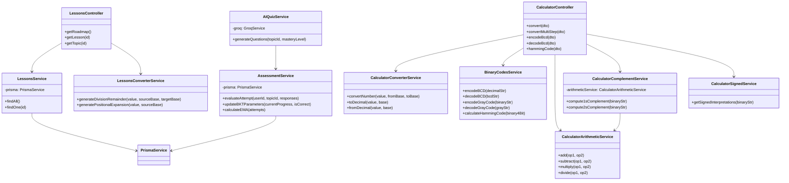
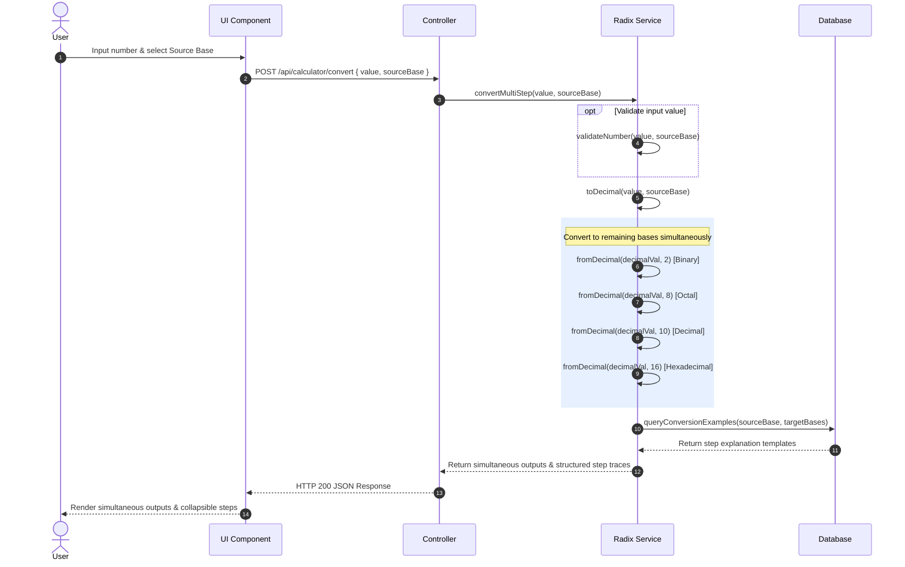
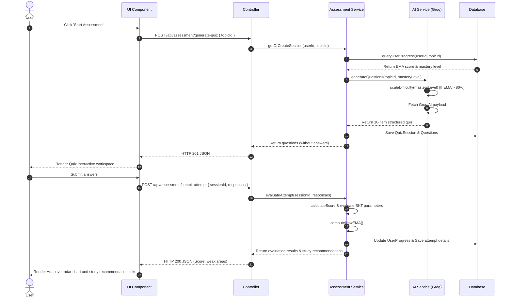

# SOFTWARE DESIGN DESCRIPTION
## BITWISE EXTENDED
### Advancing Introduction to Computer System Literacy through an Interactive Foundational Learning and Calculation Platform

**Team Code:** 2526-sem2-it332-62
**College of Computer Studies, Cebu Institute of Technology - University**
**Academic Year 2025–2026**

**Prepared by:**
* ARPON, JOSEPH CRIS E.
* ARNEJO, RALPH JOHN R.
* COTIANGCO, JAMES GABRIEL F.
* LAWAS, BERCHARD LAWRENCE D.
* MENEZ, JOHN JOSHUA L.

**Version 2.0 | Academic Year 2025–2026**

---

## Change History Signature

| Version | Date | Author | Description of Change |
|---|---|---|---|
| 1.0 | May 24, 2026 | Arnejo, Ralph John, Lawas, Berchard Lawrence, Menez, John Joshua, Cotiangco, James Gabriel, Arpon, Joseph Cris | Initial release of SDD for Bitwise Extended |
| 2.0 | May 28, 2026 | Arnejo, Ralph John, Lawas, Berchard Lawrence, Menez, John Joshua, Cotiangco, James Gabriel, Arpon, Joseph Cris | Aligned frontend and backend components with the Project Proposal features |

---

## Preface
This document describes the Software Design Description (SDD) for Bitwise Extended. It outlines the detailed design of the educational scaffolding lessons and calculation utilities.

---

## Table of Contents
1. Introduction
   1.1. Purpose
   1.2. Scope
   1.3. Definitions and Acronyms
   1.4. References
2. Architectural Design
   2.1. System Architecture Overview
   2.2. Technology Stack
   2.3. Component Interaction Diagram
3. Detailed Design
   * Module 1 – Educational Scaffolding (Learn Tab)
   * Module 2 – Multi-mode Tool Engine
   * Module 3 – Binary Representation & Encoding Systems (Learn Tab)
   * Module 4 – Adaptive AI Assessment & Progress Analytics

---

## 1. Introduction

### 1.1 Purpose
This Software Design Description (SDD) provides the comprehensive technical design blueprint for Bitwise Extended. It translates the functional and non-functional requirements specified in the Software Requirements Specification (SRS) into concrete architectural decisions, component designs, user interface specifications, and data models.

This document is intended for use by the development team as the authoritative technical reference throughout all implementation sprints. It covers the system architecture, frontend component structures, backend service designs, object-oriented class relationships, and database schema for each module of the Bitwise Extended platform.

### 1.2 Scope
The design described in this document encompasses all new modules introduced by Bitwise Extended, as well as modifications to the existing Bitwise calculator engine. The scope covers:
* The **Educational Scaffolding architecture** (seven prerequisite number system modules within the Learn tab).
* The **Multi-Mode Tool Engine** – consisting of the original Boolean Expression Solver (retained as-is from the existing Bitwise platform) and the newly added Binary Arithmetic Calculator, Number System Converter, and 1’s and 2’s Complement Solver, all accessible via an instantaneous mode toggle with step-by-step animated trace timelines.
* The **Number System Converter** – a multi-base radix translation engine integrated within the calculator workspace that converts user-inputted numbers between Binary, Octal, Decimal, and Hexadecimal simultaneously while rendering a collapsible step-by-step mathematical trace of the conversion methodology (SRS FR-2.1).
* The **Binary Representation & Encoding modules** (Signed/Unsigned Numbers, BCD, and ASCII visualizers).
* The **Adaptive AI Assessment Engine** and **Progress Analytics** radar chart dashboard.
* The overall system architecture and technology stack integration.

Legacy modules (K-Map tracker, logic gate generator, original Boolean algebra solver) are preserved without structural modification and are not re-designed in this document.

### 1.3 Definitions and Acronyms

| Term | Definition |
|---|---|
| SDD | Software Design Description |
| SRS | Software Requirements Specification |
| UI | User Interface |
| API | Application Programming Interface |
| REST | Representational State Transfer – architectural style for networked applications |
| JSON | JavaScript Object Notation – lightweight data interchange format |
| EMA | Exponential Moving Average – weighted mastery tracking algorithm |
| BKT | Bayesian Knowledge Tracing – model of student knowledge state |
| ORM | Object-Relational Mapper – maps database tables to programming language objects |
| MVC | Model-View-Controller – software architectural pattern |
| Component | A self-contained, reusable UI element within the frontend framework |
| Parser | Backend service that processes and validates user-input expressions |
| Trace Timeline | The step-by-step animated resolution display rendered after a calculation is submitted |
| Bit-row | A visual row of interactive bit cells representing a binary number |

### 1.4 References
* Bangor, A., Kortum, P. T., & Miller, J. T. (2009). Determining what individual SUS scores mean: Adding an adjective rating scale. Journal of Usability Studies, 4(3), 114–123.
* Bolante, V. M. C., Benitez, M., Cabili, K. V., & Mar, K. A. (2025). Bitwise: A Visual and Interactive Boolean Algebra Learning Platform. College of Computer Studies, Cebu Institute of Technology – University.
* Brooke, J. (1995). SUS: A quick and dirty usability scale. Usability Evaluation in Industry, 189.
* Cowan, N. (2001). The magical number 4 in short-term memory: A reconsideration of mental storage capacity. Behavioral and Brain Sciences, 24(1), 87–114.
* Fuller, J. L., & Fienup, D. M. (2017). A preliminary analysis of mastery criterion level: Effects on response maintenance. Behavior Analysis in Practice, 11(1), 1–8.
* Herman, G. L., Loui, M. C., Kaczmarczyk, L., & Zilles, C. (2012). Describing the what and why of students' difficulties in Boolean logic. ACM Transactions on Computing Education, 12(1), Article 3.
* Pelanek, R., & Rihak, J. (2017). Experimental analysis of mastery learning criteria. In Proceedings of UMAP '17.
* Tan, W. L., & Venema, S. (2019). Using physical logic gates to teach digital logic to novice computing students. In Proceedings of the International Conference on Educational Technologies.
* Whitesitt, J. E. (2012). Boolean Algebra and Its Applications. Courier Corporation.
* Zhou, Q., Zhang, H., & Li, F. (2024). The impact of online interactive teaching on university students' deep learning: The perspective of self-determination. Education Sciences, 14(6), 664.
* Cebu Institute of Technology – University SRS Template (2025–2026 Academic Year).

---

## 2. Architectural Design

### 2.1 System Architecture Overview
The system utilizes a 3-tier architecture: Presentation layer (React, TailwindCSS, TypeScript), Application layer (NestJS, TypeScript), and Database layer (PostgreSQL via Prisma ORM).

### 2.2 Technology Stack
* **Frontend:** React 19, TypeScript, TailwindCSS, Shadcn UI, TanStack Router
* **Backend:** NestJS 11, Prisma ORM, TypeScript
* **Database:** PostgreSQL (Supabase)

### 2.3 Component Interaction & Detailed Diagrams

#### A. Class Diagram (System Services & Controllers)

#### B. Sequence Diagram (Simultaneous Radix Conversion Flow)

#### C. Sequence Diagram (Adaptive AI Quiz Flow)

---

## 3. Detailed Design

### Module 1: Educational Scaffolding (Learn Tab)

#### 1.1 Introduction to Number Systems (Lesson 1)
* **Front-end component(s):**
  * *Introduction to Number System:* Displays the educational content blocks for **Lesson 1**, introducing the foundational concepts of positional value and radix (base) properties. Renders dynamic explanation blocks to visually guide students through how a single numerical value scales across Binary (Base-2), Octal (Base-8), Decimal (Base-10), and Hexadecimal (Base-16) systems in real-time alongside mathematical positional weights.
  * *Technologies:* React.js, TailwindCSS, ContentDisplay, TanStack Router.
* **Back-end component(s):**
  * *Converter Service:* Manages database querying and seeding of lesson outlines and content. Implements division-remainder and positional weight expansion algorithms to construct sequential, step-by-step base representations, positional weights, and radix conversions (operation, quotient, remainder, result) returned as JSON to visually illustrate positional value and base properties.
  * *Technologies:* NestJS, Prisma Client, PostgreSQL (Supabase), LessonsController, LessonsService, LessonsConverterService.

#### 1.2 Types of Number Systems (Lesson 2)
* **Front-end component(s):**
  * *Types of Number Systems:* Displays base relationships and digit groupings (nibbles, bytes, words) for **Lesson 2**, incorporating comparison tables mapping values 0–20 to visual base equivalents, emphasizing pattern recognition (e.g. Hex digit to 4-bit binary group).
  * *Technologies:* React.js, TailwindCSS, ContentDisplay, TanStack Router.
* **Back-end component(s):**
  * *Lessons & User Progress Services:* Manages API endpoints to query Lesson 2 metadata, details, and topic display schemas, while tracking user progress status and completion logs.
  * *Technologies:* NestJS, Prisma Client, Supabase, LessonsService, UserProgressService.

#### 1.3 Conversion of Number Systems (Lesson 3)
* **Front-end component(s):**
  * *Conversion of Number System:* Renders the educational guide for **Lesson 3**, covering division-remainder methods, positional expansion, and grouping shortcuts. Displays step-by-step conversion trees and calculations to scaffold the conversion process by breaking down complex translations into sequential, bite-sized steps, ensuring they grasp the underlying math at each step.
  * *Technologies:* React.js, TailwindCSS, ContentDisplay, TanStack Router.
* **Back-end component(s):**
  * *Lessons Converter Service:* Receives incoming conversion queries containing the input value, source base, and target base. Scaffolds the conversion process by breaking down complex translations into sequential, bite-sized steps, generating a structured JSON payload of successive divisions and positional weight calculations (including operation strings, quotients, and remainders) so that students are guided manually through the underlying math rather than just a final formula.
  * *Technologies:* NestJS, Prisma Client, PostgreSQL (Supabase), LessonsController, LessonsService, LessonsConverterService.

#### 1.4 Binary Arithmetic (Lesson 4)
* **Front-end component(s):**
  * *Binary Arithmetic Workspace:* Displays the lesson content for **Lesson 4** (Binary Arithmetic). Allows users to perform interactive binary addition, subtraction, multiplication, and division operations. Renders a vertical column-based layout that isolates and highlights active bit positions and animates carry-in/borrow bubbles in real-time as users step through a paginated trace timeline (Step X of Y).
  * *Technologies:* React.js, TailwindCSS, Shadcn, Input, Button, local step-index tracking, BinaryArithmeticWorkspace.
* **Back-end component(s):**
  * *Calculator Arithmetic Service:* Processes core arithmetic operations (+, -, *, /) for binary operands. Simulates manual column-by-column math by tracking index weights, carry propagation, and borrows to build a detailed array of step traces (describing operation inputs, intermediates, and final bits).
  * *Technologies:* NestJS, string padding, mathematical radix conversion functions, and the ArithmeticTraceStep JSON interface.

#### 1.5 Complements (Lesson 5)
* **Front-end component(s):**
  * *Complement Bit Row:* Provides the interactive complements workspace for **Lesson 5**. Features a controllable timeline showing real-time 3D bit flips (original value to 1's complement via CSS keyframe flip animations) and a carry-bubble cascade (adding +1 for 2's complement carry propagation) with toggles for rule summaries and dynamic textual explanations.
  * *Technologies:* React.js, TailwindCSS, Shadcn, Lucide Icons, ComplementBitRow component utilizing custom CSS keyframes (bit-flip) and bounce timers.
* **Back-end component(s):**
  * *Calculator Complement Service:* Handles base operations for signed integer conversions. Computes 1's complement by string bit-inversion, then generates 2's complement cascade data by invoking the CalculatorArithmeticService to add 1, returning a unified payload of trace steps.
  * *Technologies:* NestJS Injectable Service (CalculatorComplementService) returning the ComplementResult schema.

---

### Module 2: Multi-mode Tool Engine

#### 2.1 Number System Converter
* **Front-end component(s):**
  * *Number System Converter:* Renders a radix translation engine layout at the top of the Calculator tab. Accepts numeric inputs in any of the four bases (Binary, Octal, Decimal, Hexadecimal) and simultaneously outputs converted values in all three remaining bases, highlighting the active base. Provides collapsible step-by-step mathematical trace panels (`Collapsible`) for each base conversion with detailed step descriptions and conceptual explanations.
  * *Technologies:* React.js, TailwindCSS, Shadcn Select & Input, Collapsible, NumberSystemConverter.
* **Back-end component(s):**
  * *Calculator Converter Service:* Validates base limits and calculates values by parsing input strings to a decimal integer intermediate, then formatting it into the target base radix. Generates explanation blocks and logs custom conversions in the database. Supports simultaneous multi-base conversion step generation.
  * *Technologies:* NestJS Injectable Service (CalculatorConverterService).

#### 2.2 Binary Arithmetic Calculator Mode
* **Front-end component(s):**
  * *BinaryArithmeticWorkspace:* Renders a dedicated calculator workspace below the converter panel. Allows users to input binary values and select operations (+, -, *, /) to compute results. Displays interactive carries and borrows on a vertical column-based layout, and renders a paginated trace timeline (Step X of Y) with Before/After workspace highlights and labeled arithmetic rules.
  * *Technologies:* React.js, TailwindCSS, Shadcn, BinaryArithmeticWorkspace component.
* **Back-end component(s):**
  * *Calculator Arithmetic Service:* Handles core binary arithmetic addition, subtraction, multiplication, and division. Simulates digit-by-digit carry and borrow cascades to assemble a JSON array of step-by-step traces containing carried/borrowed states and step rule labels.
  * *Technologies:* NestJS Injectable Service (CalculatorArithmeticService).

#### 2.3 1's and 2's Complement Solver
* **Front-end component(s):**
  * *Complement Bit Row:* Renders a dedicated complement solver panel. Accepts a binary string input, computes and animates both the 1's complement (bit inversion with CSS flip animation) and the 2's complement (cascading +1 LSB addition with carry propagation visualization), displaying both results with animated step-by-step breakdowns.
  * *Technologies:* React.js, TailwindCSS, Shadcn, ComplementBitRow component.
* **Back-end component(s):**
  * *Calculator Complement Service:* Computes binary complement states. Inverts characters to generate the 1's complement, then delegates to the arithmetic service to add 1 to build the 2's complement cascade trace array with carry propagation data.
  * *Technologies:* NestJS Injectable Service (CalculatorComplementService).

---

### Module 3: Binary Representation & Encoding Systems (Learn Tab)

#### 3.1 Signed and Unsigned Numbers (Lesson 6)
* **Front-end component(s):**
  * *Signed and Unsigned Numbers View:* Displays the educational content for **Lesson 6** (Signed and Unsigned Numbers) using dynamic content blocks. Guides students to analyze the role of the Most Significant Bit (MSB) in data interpretation, showing how the exact same sequence of binary digits yields different decimal values depending on whether it is evaluated in an unsigned context or a signed (Two's Complement) context.
  * *Technologies:* React.js, TailwindCSS, ContentDisplay, TanStack Router.
* **Back-end component(s):**
  * *Calculator Signed Service:* Validates binary strings and computes mathematical representations for different contexts. Parses the input to resolve the unsigned value, the signed magnitude (using MSB as the positive/negative indicator), 1's complement, and 2's complement.
  * *Technologies:* NestJS Injectable Service (CalculatorSignedService).

#### 3.2 Binary Codes (BCD and ASCII) (Lesson 7)
* **Front-end component(s):**
  * *Binary Codes View:* Renders a split-screen binary codes comparison view for **Lesson 7** (Binary Codes). Explains the differences between character and numerical encoding systems, showing mapping of alphanumeric characters to their ASCII equivalents and decimal integers into 4-bit Binary-Coded Decimal (BCD) clusters.
  * *Technologies:* React.js, TailwindCSS, ContentDisplay, TanStack Router.
* **Back-end component(s):**
  * *Binary Codes Service:* Performs encoding and decoding operations for Binary Coded Decimal (BCD), Gray Code conversions, and Hamming(7,4) error-correction calculations.
  * *Technologies:* NestJS Injectable Service (BinaryCodesService).

---

### Module 4: Adaptive AI Assessment & Progress Analytics

#### 4.1 Lessons Navigation / Roadmap
* **Front-end component(s):**
  * *Boolean & Number Systems Roadmap:* Displays a visual representation of the learning path for Boolean Algebra and Number Systems. Expanded into a structured grid of eleven modules, starting with 7 prerequisite lessons followed by 4 legacy logic modules.
  * *Topic Card / Reader:* Displays lesson content with structured learning materials and embeds interactive visualizer widgets dynamically based on the active topic selection.
  * *Technologies:* React.js, Tailwind CSS, TypeScript, Magic UI.
* **Back-end component(s):**
  * *Lessons API:* Manages lesson and topic content with structured display blocks for educational material presentation.
  * *Technologies:* NestJS, Prisma ORM, PostgreSQL.

#### 4.2 Adaptive Learning
* **Front-end component(s):**
  * *Adaptive Assessment Dashboard:* Displays the final results after a quiz. It shows the user's score, highlights weakest areas, provides personalized study recommendations, and updates the multi-axis radar chart in the Progress & Analytics panel.
  * *Quiz Session Manager:* Manages the active quiz session. Displays 10-item topic-specific questions one at a time, locks answers upon submission, provides immediate explanations, and tracks progress.
  * *Technologies:* React.js, TailwindCSS, Shadcn UI.
* **Back-end component(s):**
  * *Assessment Service:* The main coordinator for quizzes. It grades user answers, updates Bayesian Knowledge Tracing (BKT) parameters, and computes Exponential Moving Average (EMA) mastery scores, calibrating next difficulty levels.
  * *AI Quiz Service:* Uses AI to dynamically generate quiz questions based on the user's current mastery level. Incorporates a **Difficulty Scaling Engine** that automatically scales question complexity when a user's EMA mastery score for a topic exceeds **80%**.
  * *Technologies:* NestJS Service (TypeScript), Supabase DB models.
